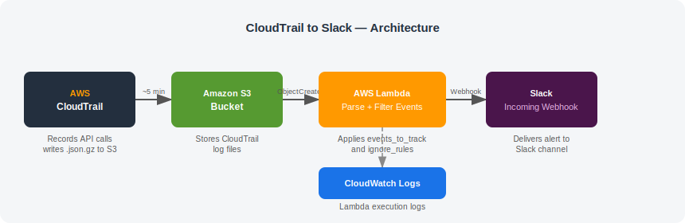

# terraform-aws-cloudtrail-slack

<br>

A reusable Terraform module that deploys a Lambda function to monitor AWS CloudTrail events and send real-time Slack alerts when infrastructure changes occur in your AWS account.

## Architecture

<picture>
  
</picture>

1. **CloudTrail** records all API calls and writes compressed log files (`.json.gz`) to S3 every ~5 minutes
2. **S3** fires an `ObjectCreated` notification when a new log file lands
3. **Lambda** downloads the file, parses all CloudTrail events, and filters them against `events_to_track` and `ignore_rules`
4. Matching events are posted to your **Slack webhook**

## Prerequisites

- An existing CloudTrail trail writing logs to an S3 bucket in the same AWS account
- A Slack incoming webhook URL
- Python 3.10 available in your system PATH (`python3.10 --version`)
- Terraform >= 1.3.0
- AWS CLI authenticated to the target account before running Terraform

## Usage

Create a caller directory and export the Slack webhook URL, then run Terraform.

```bash
export TF_VAR_slack_webhook_url="https://hooks.slack.com/services/xxx/yyy/zzz"
terraform init
terraform plan
terraform apply
```

### main.tf

```hcl
provider "aws" {
  region = "us-east-1"
}

module "cloudtrail_to_slack" {
  source  = "sudo-terraform-aws-modules/cloudtrail-slack/aws"
  version = "1.0.0"

  project_name                   = "myproject"
  cloudtrail_logs_s3_bucket_name = "my-cloudtrail-logs-bucket"
  slack_webhook_url              = var.slack_webhook_url

  events_to_track = "AuthorizeSecurityGroupIngress,RevokeSecurityGroupIngress,CreateSecurityGroup,DeleteSecurityGroup"
  ignore_rules    = "event.get('userIdentity.sessionContext.sessionIssuer.userName','').startswith('GH-OIDC')|event.get('userIdentity.type','') == 'AWSService'"
  rules_separator = "|"

  tags = {
    Environment = "production"
  }
}
```

### variables.tf

```hcl
variable "slack_webhook_url" {
  type      = string
  sensitive = true
}
```

See [`docs/DEPLOYMENT.md`](docs/DEPLOYMENT.md) for the full step-by-step deployment guide.

---

## Inputs

| Name | Description | Type | Default | Required |
|------|-------------|------|---------|----------|
| `project_name` | Short identifier for the project. Used as prefix for all resource names. Lowercase letters, numbers and hyphens only. | `string` | — | yes |
| `slack_webhook_url` | Slack incoming webhook URL. Pass via `TF_VAR_slack_webhook_url` — never hardcode in any file. | `string` | — | yes |
| `cloudtrail_logs_s3_bucket_name` | Name of the existing S3 bucket where CloudTrail logs are stored. | `string` | — | yes |
| `events_to_track` | Comma-separated list of CloudTrail event names to alert on. | `string` | *(see variables.tf)* | no |
| `ignore_rules` | Pipe-separated Python expressions. Events matching any rule are silently discarded. | `string` | *(see variables.tf)* | no |
| `rules_separator` | Separator between ignore_rules entries. | `string` | `"\|"` | no |
| `lambda_timeout_seconds` | Lambda execution timeout in seconds. | `number` | `30` | no |
| `lambda_memory_mb` | Memory allocated to Lambda in MB. | `number` | `256` | no |
| `log_level` | Lambda log level. One of: DEBUG, INFO, WARNING, ERROR. | `string` | `"INFO"` | no |
| `tags` | Additional tags applied to all resources. | `map(string)` | `{}` | no |

## Outputs

| Name | Description |
|------|-------------|
| `lambda_function_arn` | ARN of the deployed Lambda function. |
| `lambda_function_name` | Name of the Lambda function. |
| `cloudwatch_log_group_name` | CloudWatch log group for Lambda logs. |
| `iam_role_arn` | ARN of the Lambda IAM role. |

## How it works

1. **CloudTrail** records every AWS API call and batches them into `.json.gz` log files written to S3 approximately every 5 minutes.
2. **S3** fires an `ObjectCreated` notification (filtered to `AWSLogs/*.json.gz`) which triggers the Lambda function.
3. **Lambda** downloads and decompresses the log file, then evaluates each event:
   - If the event name is not in `events_to_track` → skip.
   - If any `ignore_rules` expression evaluates to `True` → skip.
   - Otherwise → send a Slack alert.
4. **Slack** receives the webhook POST and delivers the alert to the configured channel.

## Ignore Rules Examples

Ignore GitHub Actions automated deployments:
```
event.get('userIdentity.sessionContext.sessionIssuer.userName','').startswith('GH-OIDC')
```

Ignore a specific IAM user:
```
event.get('userIdentity.userName','') == 'github_action_staging'
```

Ignore AWS service automated calls:
```
event.get('userIdentity.type','') == 'AWSService'
```

Combine multiple rules with `|` separator:
```
event.get('userIdentity.sessionContext.sessionIssuer.userName','').startswith('GH-OIDC')|event.get('userIdentity.userName','') == 'github_action_staging'|event.get('userIdentity.type','') == 'AWSService'
```

## Resources Created

| Resource | Name Pattern |
|----------|-------------|
| `aws_lambda_function` | `{project_name}-cloudtrail-to-slack` |
| `aws_iam_role` | `{project_name}-cloudtrail-to-slack-lambda-role` |
| `aws_iam_role_policy` | `{project_name}-cloudtrail-to-slack-lambda-policy` |
| `aws_cloudwatch_log_group` | `/aws/lambda/{project_name}-cloudtrail-to-slack` |
| `aws_lambda_permission` | Allows S3 bucket to invoke Lambda |
| `aws_s3_bucket_notification` | Wires CloudTrail S3 bucket to Lambda |

## File Structure

```plaintext
terraform-aws-cloudtrail-slack/
├── .github/
│   └── workflows/
│       └── main.yml
├── docs/
│   ├── assets/
│   │   └── cloudtrail-to-slack-architecture.svg
│   └── DEPLOYMENT.md
├── lambda/
│   ├── main.py
│   ├── config.py
│   ├── rules.py
│   ├── slack_helpers.py
│   ├── dynamodb.py
│   ├── errors.py
│   ├── sns.py
│   └── deploy_requirements.txt
├── .gitignore
├── .pre-commit-config.yaml
├── LICENSE
├── main.tf
├── outputs.tf
├── README.md
├── variables.tf
└── versions.tf
```
